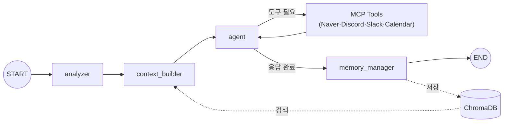

# Project ENE

> 내 모니터 위에서 나를 기억하고 함께 일하는 똑똑한 단짝 비서, ENE

**네이버 커넥트 재단 부스트캠프 AI Tech 8기** 최종 프로젝트

## ENE가 뭔가요?

감정을 교류할 수 있는 플로팅 캐릭터가 나만의 비서가 된다면 어떨까요?

기존 AI 비서(카나나, 에이닷 등)는 모바일·웹 중심이라, PC에서 작업하다가 메일 확인하고 일정 잡고 메시지 보내려면 여전히 탭을 여러 개 열어야 합니다. 캐릭터 서비스는 정해진 대사만 반복하고요.

ENE는 **데스크톱에 상주하면서, 대화만으로 이 모든 걸 처리하는 AI 비서**입니다.

- 대화할수록 호감도가 오르고, **말투와 반응이 달라집니다** (10단계 호감도 시스템)
- 과거 대화를 기억해서 **"저번에 좋아한다던 매운 맛집 찾아봤어요!"** 같은 맥락 있는 답변을 합니다
- 네이버 검색, Discord/Slack 메시지 전송, Google Calendar 일정 관리를 **대화만으로** 처리합니다
- PySide6 GUI에서 7가지 감정의 캐릭터 애니메이션이 실시간으로 반응합니다

### 이런 걸 할 수 있습니다

- **"제주도 맛집 검색해서 디스코드에 보내줘"** — 네이버 검색, 요약, Discord 전송까지 한 번에
- **"다음 주 빈 시간 확인하고 회의 잡아줘"** — Google Calendar 조회 → 일정 등록
- **"아까 검색한 맛집 다시 알려줘"** — 과거 대화를 기억해서 맥락을 이어감

## 어떻게 동작하나요?

"제주도 맛집 검색해서 디스코드에 보내줘" — 이 한 마디가 ENE 내부에서 어떻게 처리되는지 따라가 보겠습니다.

그 전에 한 가지. 이걸 만들 때 가장 어려웠던 건, **페르소나 규칙, 도구 호출 규칙, 과거 대화 기억을 매 턴마다 하나의 프롬프트로 조립해야 한다**는 점이었습니다. 호감도가 바뀌면 말투가 달라지고, 기억이 쌓이면 프롬프트가 달라지고, 도구를 호출하고 돌아올 때마다 맥락이 바뀝니다. 이 조합이 매 턴 다르기 때문에 "한 번 잘 짜놓으면 끝"이 아니라, 매 순간 동적으로 조립해야 합니다.



### 1단계: 감정 분석 (analyzer)

사용자의 말투에서 감정과 호감도 변화를 먼저 읽습니다. "검색해서 보내줘"는 평범한 요청이니 호감도 변화 없이 넘어갑니다. 하지만 "고마워 진짜 최고야!"라고 했다면 호감도가 올라가고, "아 짜증나 왜 맨날 틀려"라고 했다면 내려갑니다.

이게 왜 중요하냐면, 호감도에 따라 ENE의 말투가 완전히 달라지기 때문입니다:

| 호감도 | 말투 | 같은 검색 결과를 전달할 때 |
|--------|------|---------------------------|
| 0 ~ 9 | 극존칭 하십시오체 | "검색 결과를 안내해 드리겠습니다." |
| 20 ~ 29 | 정중한 존댓말 | "검색해 봤습니다. 참고해 주세요." |
| 40 ~ 49 | 온기 있는 해요체 | "찾아봤어요! 여기 맛집 목록이에요~" |
| 70 ~ 79 | 편한 반말 섞인 해요체 | "오 맛집! 나 이거 찾아놨어요, 봐봐요~" |
| 90 ~ 100 | 소꿉친구 반말 | "오 제주도 간다고?! 나 맛집 찾아놨어!! 여기 봐봐!!" |

호감도(0~100) 10단계와 만남 일수 10단계가 조합되어 **100가지 이상의 페르소나 변화**를 만듭니다. 처음 만난 사람에게 반말하면 어색하듯, ENE도 관계가 쌓여야 편하게 말합니다. 호감도는 SQLite에 영구 저장되므로, 앱을 껐다 켜도 관계가 이어집니다.

### 2단계: 기억 검색 + 프롬프트 조립 (context_builder)

ChromaDB에서 "제주도", "맛집", "여행"과 관련된 과거 기억을 검색합니다. 3일 전에 "나 다음 주 제주도 가"라고 했다면 그 기억이 함께 프롬프트에 들어갑니다.

여기서 문제는, **페르소나 말투 + 도구 규칙 + 과거 기억 + 관계 상태를 전부 하나의 시스템 프롬프트에 담아야 한다**는 겁니다. 그런데 LLM은 긴 프롬프트에서 **시작과 끝 정보는 잘 기억하지만, 중간은 놓치는 경향**이 있습니다 (Liu et al., 2023). 아무리 좋은 페르소나를 써놔도 프롬프트 중간에 묻히면 LLM이 그냥 무시합니다.

그래서 프롬프트를 이렇게 설계했습니다:

```
┌──────────────────────────────────────────────┐
│ <persona>                        ← 핵심      │  시작 (잘 기억)
│   말투 + 호감도 + 관계 상태                  │
│                                               │
│ <memories>  과거 기억             ← 참고      │
│ <tools>     사용 가능한 도구                  │  중간
│ <timestamp> 현재 시각                         │
│                                               │
│ <response_format>  JSON 스키마   ← 핵심       │  끝 (잘 기억)
│ <rules>  말투 유지 리마인더                   │
└──────────────────────────────────────────────┘
```

페르소나 말투를 맨 위에, 응답 형식을 맨 아래에 둬서 LLM이 "어떻게 말해야 하는지"를 절대 잊지 않게 합니다. 기억 리스트도 관련도 높은 기억을 양 끝에 배치하고, 토큰 budget(2048)을 초과하면 관련도 낮은 것부터 제거합니다.

### 3단계: 응답 생성 + 도구 호출 (agent)

조립된 프롬프트를 받은 agent가 "맛집을 검색해야 하니까 naver_blog_search를 호출하자"고 판단합니다. 검색 결과를 받아서 요약한 뒤, "Discord에 보내야 하니까 send_message를 호출하자"고 다시 판단합니다. 이렇게 **생각 → 도구 호출 → 결과 확인 → 다시 생각**을 반복하는 ReAct 루프 덕분에, 단순 응답이 아니라 실제 작업 수행이 가능합니다.

이 루프가 돌 때마다 새로운 정보(검색 결과, 도구 응답)가 컨텍스트에 쌓이면서 페르소나가 흐려질 수 있습니다. 앞서 프롬프트 시작과 끝에 페르소나를 고정해둔 이유이기도 합니다.

여기서 검색은 실수해도 괜찮지만 **메시지 전송은 되돌릴 수 없으므로**, ENE가 먼저 물어봅니다: "디스코드 #여행 채널에 보내도 될까요?" 사용자가 확인해야만 전송됩니다. 이렇게 안전한 도구(검색, 조회)는 자동 실행하고, 민감한 도구(전송, 수정)는 사용자 승인을 거치는 구조입니다.

### 4단계: 기억 저장 (memory_manager)

대화가 끝나면 이 대화를 기억합니다. 다음에 "아까 그 맛집 다시 알려줘"라고 하면 ChromaDB에서 꺼내옵니다.

그런데 LLM의 Context Window는 유한합니다. 기억이 쌓일수록 프롬프트가 길어지고, 결국 페르소나나 도구 규칙을 밀어내게 됩니다. 그래서 대화가 길어지면 오래된 내용을 **Clova Summary API로 요약**해서 장기 메모리(ChromaDB)에 아카이브합니다. 단기 메모리(SQLite)가 현재 흐름을 유지하고, 장기 메모리가 과거를 보존하는 이중 구조 덕분에 "지난주에 한 이야기"도 기억할 수 있습니다.

> 프롬프트 설계 상세는 [`docs/개선1.md`](docs/개선1.md) 참조

## 프로젝트 구조

```
.
├── MCP_agent/                     # 메인 에이전트
│   ├── graph.py                   # LangGraph 파이프라인
│   ├── config.py                  # MCP 서버 설정
│   ├── agent/                     # GUI, CLI, 페르소나 로직
│   ├── nodes/                     # analyzer, context_builder, memory_manager
│   ├── memory/                    # ChromaDB 어댑터, 인터페이스
│   └── utils/                     # Clova Studio 실행기
│
├── mcp_servers/                   # MCP 서버 (독립 실행)
│   ├── naver_mcp.py               # Naver 검색 (port 8000)
│   ├── discord-mcp.py             # Discord (port 8001)
│   └── scripts/                   # 서버 시작/설치 스크립트
│
├── evaluation/                    # 평가 프레임워크
│   ├── deep_eval_pr.py            # ArenaGEval 블라인드 비교
│   ├── deep_eval_tool.py          # Tool Call 정확도 평가
│   ├── eval_ab.py                 # A/B 테스트
│   └── configs/                   # 평가 시나리오/메트릭 설정
│
└── docs/                          # 설계 문서
```

## 설치 및 실행

### 1. 환경 설정

```bash
git clone https://github.com/YangHyunu/ENE-persona-agent.git
cd ENE-persona-agent

uv venv && source .venv/bin/activate
uv sync
```

### 2. 환경변수

`.env.example`을 참고하여 `.env` 파일 생성:

```bash
OPENAI_API_KEY=your_openai_api_key
NCP_CLOVASTUDIO_API_KEY=your_clova_api_key
NAVER_CLIENT_ID=your_naver_client_id
NAVER_CLIENT_SECRET=your_naver_client_secret
DISCORD_TOKEN=your_discord_bot_token
```

### 3. 실행

```bash
# MCP 서버 시작
bash mcp_servers/scripts/start-slack-mcp.sh

# 에이전트 실행 (새 터미널)
python MCP_agent/agent/clova_mcp_gui.py
```

## 평가

위에서 설명한 프롬프트 설계와 호감도 시스템이 정말 효과가 있는지, DeepEval 기반으로 검증했습니다.

- **프롬프트 품질 비교** — ArenaGEval로 8개 메트릭(페르소나 유지, 맥락 활용, 자연스러움 등)을 블라인드 비교
- **도구 호출 정확도** — 33개 시나리오에서 올바른 도구를 올바른 인자로 호출하는지 평가
- **A/B 테스트** — 동일 입력에 대해 프롬프트 전략별 응답 품질을 반복 비교

```bash
python evaluation/deep_eval_pr.py        # 블라인드 비교 (8개 메트릭)
python evaluation/deep_eval_tool.py      # Tool Call 정확도 (33개 시나리오)
python evaluation/eval_ab.py --rounds 10 # A/B 테스트
python evaluation/compare_prompt.py      # 프롬프트 구조 비교
```

## 기술 스택

Python, LangGraph, LangChain, FastMCP, ChromaDB, PySide6, OpenAI API, NCP Clova Studio, DeepEval

## 링크

- [프로젝트 소개 페이지](https://ait8networkingday.oopy.io/302f145d-e995-8163-816c-f6e0a5119fe2)
- [데모 사이트](https://yanghyunu.github.io/ENE_html/)
- [발표 영상](https://youtu.be/TSgeEeFh40o)

## 참고 자료

- [LangGraph](https://langchain-ai.github.io/langgraph/) / [FastMCP](https://github.com/jlowin/fastmcp) / [MCP Protocol](https://modelcontextprotocol.io/) / [DeepEval](https://docs.confident-ai.com/)
- Liu et al., 2023 — "Lost in the Middle: How Language Models Use Long Contexts"
